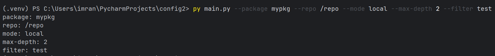
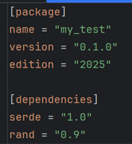
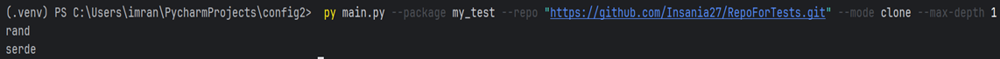
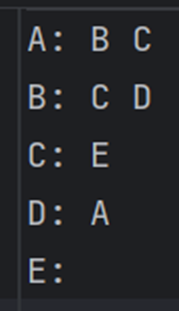
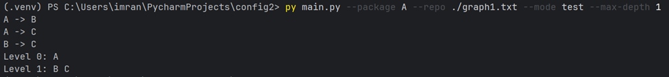
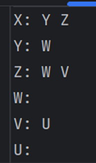
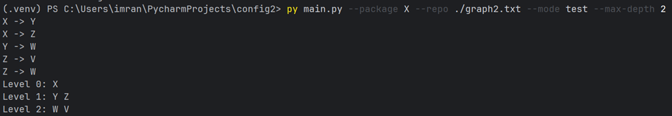

**4 вариант**

**Этап 1. Минимальный прототип с конфигурацией**

Цель: создать минимальное CLI-приложение и сделать его настраиваемым.

**Этап 2. Сбор данных**

Цель: реализовать основную логику получения данных о зависимостях для их 
дальнейшего анализа и визуализации. Запрещено пользоваться менеджерами 
пакетов и сторонними библиотеками для получения информации о зависимостях 
пакетов. 

Файл Cargo.toml:

Тест:

**Этап 3. Основные операции**

Цель: построить граф зависимостей (с учетом транзитивности) и выполнить 
основные операции над ним.

Файл graph1.txt

Тест:

Файл graph2.txt

Тест:

